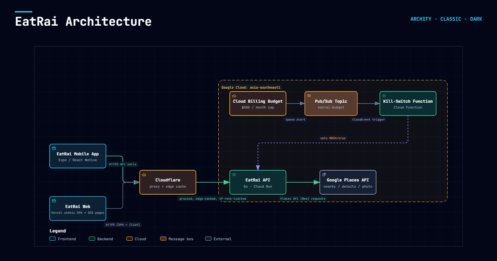

# EatRai — "กินไร?" / What to eat?

A restaurant-finder with a Tinder-style swipe deck. Point it at your location,
optionally filter by category, swipe through nearby places, and open the ones you
like in Maps.

**No accounts, no server-side database.** The backend is a thin stateless proxy
over Google Places. Right-swipes are saved **on the device** (AsyncStorage /
localStorage) so they're there when you come back — nothing syncs, nothing leaves
the phone.

## Architecture



No database, no accounts — the client is entirely stateless. Cloudflare fronts
Cloud Run for edge caching and a rate-limit rule; the Go API enforces per-IP and
per-client quota before ever calling Places. A Cloud Billing budget alert can
trip a kill-switch that forces `MOCK=true` so the app keeps serving generated
data with zero further Places spend until a human clears it
(`infra/killswitch/`).

## Stack

- **Mobile:** React Native (Expo, TypeScript) — `gesture-handler` + `reanimated`
  for the deck, `zustand` for session state, `expo-image` for photos, Anuphan +
  Kanit (`@expo-google-fonts`)
- **Backend:** Go 1.23 — chi. One binary, three `GET` routes, an in-memory TTL
  cache. No persistence.
- **Data:** Google Places API (New) — Nearby Search + Place Photos. Without a key
  the backend serves a curated set of real restaurants around the
  Chula – Samyan – Siam Square area so the app is demoable offline.

## Run it locally

```bash
# backend — runs in MOCK mode with no key
cd backend
cp .env.example .env
make run                     # proxy on :8080

# mobile
cd ../mobile
cp .env.example .env.local   # EXPO_PUBLIC_API_URL=http://localhost:8080
npm install
npx expo start               # press a / i, or w for web
```

To use live data, put a **Places API (New)** key in `backend/.env`
(`GOOGLE_PLACES_API_KEY=...`) and restart — the app switches to real nearby
results and photos everywhere, no code change.

## Deploy

Backend: `backend/Dockerfile` → any container host (Cloud Run / Fly / Render) or a
plain binary. Set `GOOGLE_PLACES_API_KEY` and `CORS_ORIGIN`. Mobile: `expo export
--platform web` for the web build, EAS Build for native.

Full runbook is in `docs/DEPLOYMENT.md` (kept local, not in this repo).

## Backend API

```
GET /status, /healthcheck                            -> {ok, mock, noFetch, cache, quota, iplimit, degraded}
GET /nearby?lat&lng&cuisine&lang                      -> {cards: [Card]}  (grid-cell cache; filtering is client-side)
GET /place?id&lat&lng&lang                            -> Place details (cached 24h)
GET /list?ids=a,b,c&lang                              -> Place[] for a shared list, one round trip, bounded concurrency
GET /geocode?address                                  -> geocoded location
GET /suggest?input                                    -> place autocomplete suggestions
GET /reverse?lat&lng                                  -> reverse-geocoded address
GET /photo?name=places/<id>/photos/<id>&w=900          -> image bytes (key stays server-side)
```

All routes above except `/status`/`/healthcheck` sit behind a per-IP rate
limiter; `/nearby`, `/place`, `/list`, `/geocode`, `/suggest`, `/reverse` also
sit behind an origin gate (`REQUIRE_ORIGIN`) and a monthly quota meter
(`internal/quota`) that soft-degrades to stale cache or an honest error once a
per-SKU free-tier cap is hit — see `internal/iplimit`, `internal/ratelimit`,
and `docs/COST_AND_MONETIZATION_PLAN.md`. `/nearby` results are cached per grid
cell (`internal/grid`) for `CACHE_TTL`; a `CACHE_BUCKET` snapshots the warm
cache to GCS so a Cloud Run cold start doesn't start empty.

Config (`backend/.env`): `HTTP_ADDR`, `CACHE_TTL`, `CACHE_BUCKET`,
`CACHE_SNAPSHOT_EVERY`, `CORS_ORIGIN`, `REQUIRE_ORIGIN`, `RATE_LIMIT_RPM`,
`GOOGLE_PLACES_API_KEY`, `MOCK`, `NO_FETCH`, `FREE_CAP_SEARCH`,
`FREE_CAP_DETAILS`, `FREE_CAP_PHOTO`, `IPLIMIT_HOUR`, `IPLIMIT_DAY`,
`IPLIMIT_IP_HOUR`, `IPLIMIT_IP_DAY`.

## Layout

```
backend/
  cmd/api/            entrypoint
  internal/
    config/           env config
    places/           Places (New) client + normalisation + curated mock data
    cache/            in-memory TTL cache (+ optional GCS snapshot)
    grid/             lat/lng -> cache-cell mapping for /nearby
    quota/            monthly per-SKU free-tier meter (search/details/photo)
    iplimit/          per-IP / per-client fetch budgeting
    ratelimit/        per-IP requests-per-minute limiter
    httpapi/          chi router: status, nearby, place, list, geocode, suggest, reverse, photo
mobile/
  src/
    api/client.ts     backend client (nearby, place, list, geocode, suggest, reverse)
    store/session.ts  filters + liked pile, persisted on-device (zustand persist)
    lib/              categories, formatting, i18n, deck ads, sharing, coverage, decide logic
    components/       SwipeCard, ActionBar, TopBar, FilterSheet, LikedSheet, RestaurantSheet,
                       DecideSheet, AdCard, AreaSearch, LocationForm, MapLocationScreen,
                       FeedbackSheet, GuidePrompt, HelpSheet
    screens/          DeckScreen (main app), SharedListScreen (opening a shared list link)
    theme/tokens.ts   "Fresh Market" palette + fonts
```

## Category filters

The app's filter keys (`src/lib/categories.ts`) map to Places (New) primary types
in `backend/internal/places/places.go` (`categoryTypes`). Unknown keys fall back
to a plain `restaurant` search.
